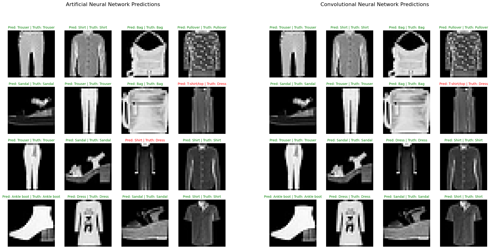

# Data Science Portfolio

## Project #1: [_Comparison Artificial Neural Network vs Convolutional Neural Network for Images Classification_](https://github.com/acadena-repo/COMPARISON-ANN-VS-CNN-FOR-IMAGES-CLASSIFICATION)

Comparison of a _simple `Convolutional Neural Network`_ and an _Artificial Neural Network_ without `activation functions` (**only linear layers were used**). The experiment aims to compare the performance of both models measuring the level of accuracy of each model to classify correctly a set of images. From the model's point of view the comparison will be only on the **model's architecture**, so the same metaparameters are used to train both models.

**Keywords: `Images Classification,` `Artificial Neural Network,` `Convolutional Neural Network,` `Deep Learning`**

 

 
<i>Comparison of images classification by ANN and CNN</i>

 

## Project #2: [_Pattern Recognition for Leakage Detection in Hydraulic Systems_](https://github.com/acadena-repo/PATTERN-RECOGNITION-FOR-LEAKAGE-DETECTION-IN-HYDRAULIC-SYSTEMS)

Machine Learning pipeline composed of a [`Kalman Filter`](https://en.wikipedia.org/wiki/Kalman_filter), an `Oriented Gradient` algorithm and a `Pattern Classifier` which is based on [`Hierarchical Clustering Analysis`](https://en.wikipedia.org/wiki/Hierarchical_clustering). The model is designed to run recusively, so it can recognize different events in a hydraulic system and continuosly monitoring for anomaly detections such as _oil leakages_.

**Keywords: `Optimal Estimation,` `Feature Engineering,` `Pattern Recognition,` `Unsupervised Learning,` `Hierarchical Clustering`**

 

 
<i>Different patters found in a hydraulic system</i>

 

## Project #3: [_Denoising Images using Autoencoders_](https://github.com/acadena-repo/DENOISING-IMAGES-USING-AUTOENCODERS)

In this project I explore the capability of an Autoencoder to _learn_ a simplified version of the input data which are images of handwritten digits, then I introduce `noise` into the images by **occlusion** of a section in the image. And an Autoencoder is tested on how well it removes the `noise`, reconstructing the images using the reduced interpretation learned previously.

**Keywords: `Image Processing,` `Dimensionality Reduction,` `Deep Learning,` `Autoencoders`**

 

 
<i>Reconstruction of occluded images with an Autoencoder</i>

 

## Project #4: [_Face Recognition with Histogram-of-Oriented-Gradients_](https://github.com/acadena-repo/HISTOGRAM-OF-ORIENTED-GRADIENTS-APPLIED-TO-FACE-RECOGNITION)

In this project [**Histogram of Oriented Gradients**](https://scikit-image.org/docs/stable/auto_examples/features_detection/plot_hog.html) algorithm is used to extract features from human faces. A total of **13,000** images were used to train a `Support Vector Machine` used as a classifier to recognize human faces from different images.

**Keywords: `Image Processing,` `Data Wrangling,` `Machine Learning,` `SVC Classifier.`**

 

 
<i>Image processed with HOG</i>

 
